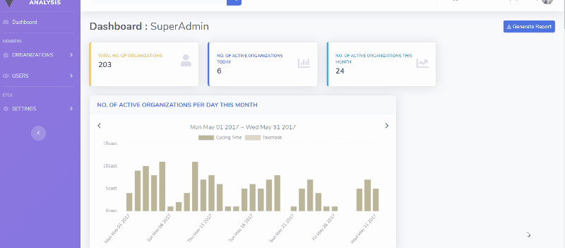

# Data Visualization Dashboard

### Node.js / PostgreSQL web app with charts and tables

---

This dashboard visualizes users' cycling data in bar charts, stacked-bar charts, pie charts, and sortable tables by fetching and manipulating data from database. There are three login types, which are superadmin, admin, and users, therefore, the software responds to at least 6 different numbers of cases of visualizing their data. Since the database lives in my own localhost, which is not pushed in this repository, and all other data that might be considered private are anonymized or gitignored, downloading and compiling the software will not result in getting it running. Therefore, this app is for code-review purpose only please.

Instead, you can check out the anonymized version of preview down below.

---

## BUILT WITH :

- `Node.js`,
- `PostgreSQL`,
- `JavaScript`,
- `Chart.js`,
- `DataTable.js`,
- `jQuery`,
- `AJAX`

## PREVIEW :

